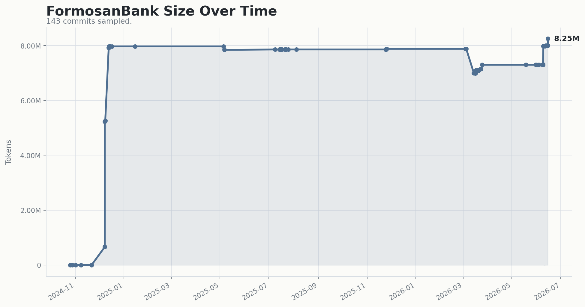
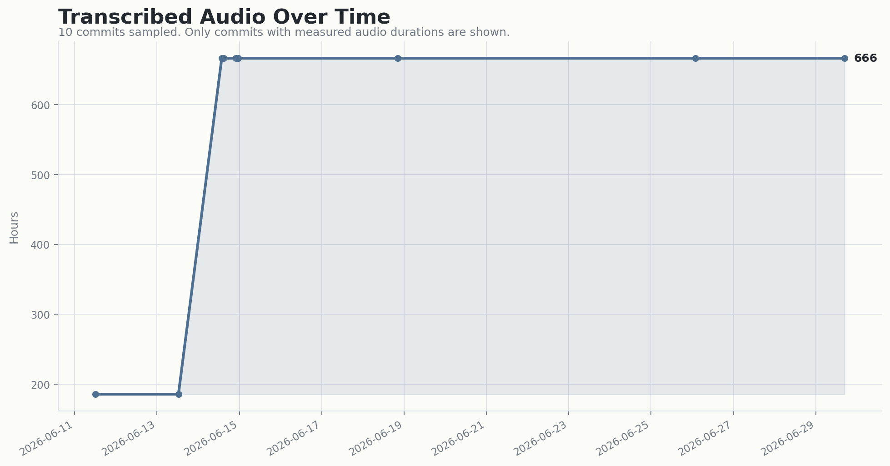
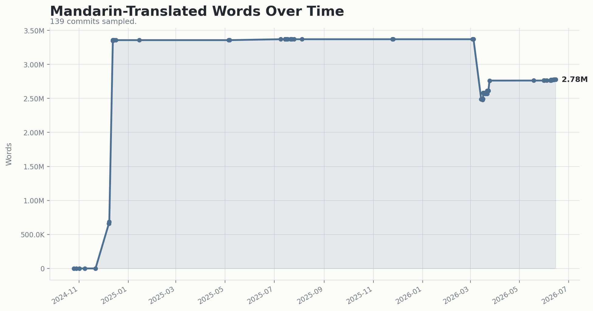
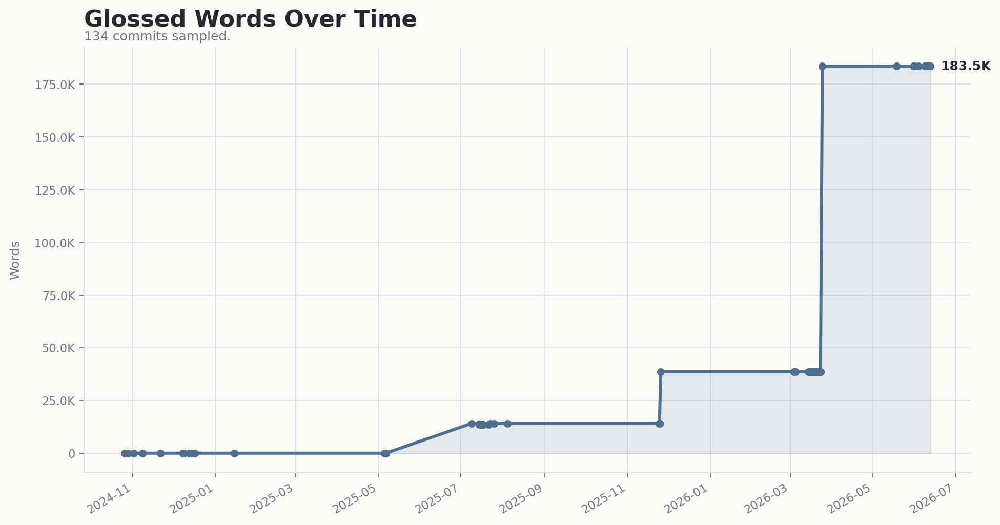

# Corpora

## License and AI Use

FormosanBank materials are subject to corpus-specific source licenses and the central terms in [LICENSE.md](LICENSE.md), [NOTICE-AI.md](NOTICE-AI.md), and [AI-USE-ADDENDUM.md](AI-USE-ADDENDUM.md). Commercial AI Use is prohibited without prior written permission.

## Corpus Growth






The growth graphs are updated by the Corpus Metrics GitHub Action after pushes to `main`. Detailed JSON, Markdown, and plot outputs stay attached to each workflow run as 30-day artifacts; only the README graph and its history CSV are kept in `statistics/`. The CSV is reused as the history cache, so routine updates only apply new XML-changing commits.

---

# Quality Control

This directory contains a set of Python scripts and resources for quality control (QC) and data processing for Formosan Bank, focusing on things orthography chceks, validation, cleaning data, etc. The intended use of each script and its functionality is outlined below:

---

## Table of Contents

1. [Repository Structure](#repository-structure)
2. [Prerequisites](#prerequisites)
3. [Installation](#installation)
4. [Usage](#usage)
    - [Cleaning Scripts](#cleaning-scripts)
    - [Orthography Scripts](#orthography-scripts)
    - [Validation Scripts](#validation-scripts)
    - [Additional Scripts](#additional-scripts)
5. [Logs](#logs)

---

## Repository Structure

```plaintext

Corpora/
...

QC/
├── cleaning/
│   ├── clean_xml.py
├── orthography/
│   ├── logs/
│   │   ├── Amis_ePark
│   │   └── Amis_ILRDF_Dicts
│   ├── orthography_compare.py
│   └── orthography_extract.py
├── validation/
│   ├── logs/
│   ├── iso-639-3.txt
│   ├── validate_xml.py
│   ├── validate_text.py
│   └── xml_template.xsd
├── count_tokens.py
```

Each subfolder and script serves a specific purpose related to the quality control and processing of FormosanBank data.

---

## Prerequisites

- Python 3.6+
- Tkinter (for GUI-based scripts)
- Required libraries can be installed using `pip install -r requirements.txt` (see the [Installation](#installation) section for more details).

### Installing Tkinter

#### macOS
```bash
brew install python-tk
```

#### Ubuntu
```bash
sudo apt-get install python3-tk
```

#### Windows
Tkinter is included with the standard Python distribution for Windows. No additional installation is required.

---

## Installation

Clone the repository and install dependencies.

```bash
git clone <repository-url>
cd FormosanBank
pip install -r requirements.txt
./run_audio_downloads.sh
```

Note that `run_audio_downloads.sh` depends on having git, git-lfs, jq, and hf (the huggingface cli) installed. On a Mac, use:

```bash
brew install git git-lfs jq
pip install huggingface_hub[cli]  # This installs the 'hf' command
```

---

## Usage

### Validation Scripts

1. **`validate_text.py`**
  - **Purpose**:
    Validates the *textual content* of `<FORM>` and `<TRANSL>` elements in XML corpora.
    Replaces the legacy `validate_punct.py` and `non_ascii_counts.py` single-purpose
    scripts (deleted in B9.4): smart quotes, imbalanced parentheses, repeated
    punctuation, consecutive dashes, multiple whitespace, mismatched smart
    quotes, non-ASCII characters (excluding CJK), null-symbol propagation
    across W/M/S tiers, parens/slashes in W/M FORM, and `=` leftovers.
    The script **detects** issues; remediation lives in `clean_xml.py` and
    per-corpus pipelines.
  - **Usage**:
    Run the script from the command line as follows:
    ```bash
    python3 QC/validation/validate_text.py [arguments]
    ```
    Example for validating a specific XML directory:
    ```bash
    python3 QC/validation/validate_text.py by_path --path /path/to/Final_XML
    ```
  - **Arguments**:
    - `search_by`: Specifies the search method. Options:
      - `by_language`: Validate based on language code. Requires `--language` and `--corpora_path`.
      - `by_path`: Validate a specific file or directory. Requires `--path`.
      - `by_corpus`: Validate based on corpus name. Requires `--corpus` and `--corpora_path`.
    - `--language`: ISO 639-3 code (e.g., `ami`) (required for `by_language`).
    - `--corpora_path`: Path to the directory containing the corpora (required for `by_language` and `by_corpus`).
    - `--path`: Path to a specific XML file or directory (required for `by_path`).
    - `--corpus`: Corpus name (required for `by_corpus`).
    - `--soft-csv`: Where to write the per-(rule, file, language, character) SOFT
      findings CSV (defaults to `logs/validation_text_soft.csv`).
    - `--no-exit-on-hard`: Always exit 0, even when HARD findings are produced
      (informational mode).

  HARD findings exit 1 (blocking); SOFT findings exit 0 but populate the CSV
  artifact for review.

2. **`validate_xml.py`**
   - **Purpose**: Validates XML files by ensuring they conform to a predefined structure, checking ISO language codes, and reformatting XML content.
   - **Usage**:
     ```bash
     python3 QC/validation/validate_xml.py <search_method> --language <language_code> --corpus <corpus_name> --path <file_path> --corpora_path <corpora_path> --verbose
     ```
   - **Arguments**:
     - `--search_by`: Defines the method to search for validation (`by_language`, `by_corpus`, or `by_path`). Always required
     - `--language`: Specifies the language to be validated (required when searching `by_language`).
     - `--corpus`: Specifies the corpus name for validation (required when using `by_corpus`).
     - `--path`: Path to the XML file (or directory; if directory is provided, all XML files within will be checked) to be validated (required when using `by_path`).
     - `--corpora_path` Path to the directory containing all the corpora. (required when using `by_language` and `by_corpus`)
     - `--verbose` when used, Detailed logs will be saved in a log file. Log will include which files have been checked and a detailed record if whether there has been any issues or not. The search mood is indicated by the log file name. A summary of issues can be found the buttom of the log file

   - **Examples**:
     - Validate by language:
       ```bash
       python3 QC/validation/validate_xml.py by_language --language "Amis" --corpora_path "./Corpora"
       ```
     - Validate by corpus and use verbose:
       ```bash
       python3 QC/validation/validate_xml.py by_corpus --corpus "ePark" --corpora_path "./Corpora" --verbose
       ```
     - Validate by path:
       ```bash
       python3 QC/validation/validate_xml.py by_path --path "./Corpora/ePark/ep1_九階教材"
       ```
   - **Associated Files**:
     - `iso-639-3.txt`: A text file containing ISO 639-3 language codes used to verify that the `xml:lang` attribute in XML files contains a valid code.
     - `xml_template.dtd`: A Document Type Definition (DTD) file specifying the required structure of the XML files. The script validates XML files against this template to ensure consistency.

3. **`validate_orthography.py`**
   - **Purpose**: Compares the orthographic information of a target corpus with a reference corpus for a specified Formosan language.
   - **Usage**:
     ```bash
     python3 path-to-FormosanBank/QC/validation/validate_orthography.py --o_info <log_folder_name> --language <language>
     ```
   - **Arguments**:
     - `--o_info`: Name of the log folder containing orthographic information that will be analyzed. You must be in the root directory of the corpus repository.
     - `--language`: Name of Formosan language to be analyzed.
   - **Expected Output**
     - Console output with several metrics of orthographic similarity. Warnings will be issued for worrisome numbers.
     - A png named `character_frequency_comparison_...` that visualizes the character distributions, saved in folder the script was run from.
   - **Notes**
     - The reference orthography for Bunun does not use `e`, probably because it is (presumably) based on the Isbukun dialect.
     - The reference orthography for Kanakanavu does not use `h` or `f`.

4. **`validate_vocabulary.py`**
   - **Purpose**: Compares the 100 most common words in the target corpus with a reference corpus for a specified Formosan language.
   - **Usage**:
     ```bash
     python3 path-to-FormosanBank/QC/validation/validate_vocabulary.py --o_info <log_folder_name> --language <language_code>
     ```
   - **Arguments**:
     - `--o_info`: Name of the log folder containing vocabulary information that will be analyzed. You must be in the root directory of the corpus repository.
     - `--language`: Name of Formosan language to be analyzed.
   - **Expected Output**
     - Console output with several metrics of similarity. Warnings will be issued for worrisome numbers.
     
### Cleaning Scripts

**`clean_xml.py`**
  - **Purpose**:  
    Cleans XML files by standardizing punctuation, removing unnecessary characters, and normalizing text. The script modifies `<FORM>` and `<TRANSL>` elements in XML files to ensure consistency and readability.

  - **Usage**:  
    Run the script from the command line as follows:  
    ```bash
    python3 QC/cleaning/clean_xml.py --corpora_path
    ```  
    Example to clean all XML files in a specific directory:  
    ```bash
    python3 QC/cleaning/clean_xml.py --corpora_path /path/to/corpora
    ```

  - **Arguments**:  
    - `--corpora_path`: Path to the directory containing XML files to process. (Required)  

  This script modifies the XML files in place, ensuring clean and consistent text formatting across the corpora. Use this as a follow-up to `validate_text.py` for automated cleaning.

  A log will be generated in --corpora_path for any adjustments of HTML entities. Nothing else is currently logged.

  The following punctuation transformations are instituted:

```
  {
        '（': '(',
        '）': ')',
        '：': ':',
        '，': ',',
        '？': '?',
        '。': '.',
        '》': '"',
        '《': '"',
        '」': '"',
        '「': '"',
        '、': ',',
        '】': ')',
        '【': '(',
        ']': ')',
        '[': '(',
        '〔': '(',
        '〕': ')',
        '“': '"',  # Left double quotation mark
        '”': '"',  # Right double quotation mark
        '‘': "'",  # Left single quotation mark
        '’': "'",   # Right single quotation mark
        'ˈ': "'",
        'ʻ': "'"
    }
```

### Analysis Scripts

1. **`count_tokens.py`**
   - **Purpose**: Counts the current number of tokens in the corpora both by language and by source
   - **Usage**: `python3 QC/count_tokens.py <corpora_path>`
   - **Example**: `python3 QC/count_tokens.py ./Corpora`
   - **Output** The code will output the count for each language as well as the count per resource then will print the total token count across the corpora

2. **`orthography_compare.py`**
   - **Purpose**: Compares orthographic features between two corpora using various similarity and distance metrics to determine if the two corpora use the same orthography or not.
   - **Usage**:
     ```bash
     python3 QC/orthography/orthography_compare.py --o_info_1 <orthographi_info_path1> --o_info_2 <orthographi_info_path2>
     ```
   - **Arguments**:
     - `--o_info_1`: Specifies the path to the first log folder containing the orthograpihc info. Should be in the format `Language_Corpus`.
     - `--o_info_2`: Specifies the path to the second log folder containing the orthograpihc info. Should be in the format `Language_Corpus`.

   - **Analysis Metrics Used**:
     - **Jaccard Similarity**: Measures the overlap between sets of characters in the two corpora.
     - **Overlap Coefficient**: Compares the intersection of character sets, normalized by the smaller set size.
     - **Cosine Similarity**: Computes similarity based on the angle between character frequency vectors.
     - **Euclidean Distance**: Measures the straight-line distance between frequency vectors, indicating overall difference.
     - **Kullback-Leibler (KL) Divergence**: Measures the difference in information between character distributions.

   - **Output**:
     - This script generates comparison visuals for each similarity and distance metric, helping users understand the differences in orthography between corpora.

3. **`orthography_extract.py`**
   - **Purpose**: Extracts and analyzes orthographic features, such as character frequencies, from XML files for specific languages and corpus.
   - **Usage**:
     ```bash
     python3 QC/orthography/orthography_extract.py --language <language> --corpus <corpus> --corpora_path <corpora_path>
     ```
   - **Arguments**:
     - `--language`: Specifies the language to process (e.g., `Amis`).
     - `--corpus`: Specifies the corpus directory containing XML files (e.g., `./Corpora/ePark`). Can be set to `All` if all corpora of the specified language desired to be used.
     - `--corpora_path` Path to the directory containing all the corpora. (required only when `--corpus` is set to `All`)
     - `--kindOf` Specify if you want to look at a particular type of FORM (e.g., `original` or `standard`).
     - `--by_dialect` If any value is given, will extract orthography separately for each dialect (as specified in the `dialect` attribute of the XML file.)

   - **Examples**:
     - Analyze the Amis language in the `ePark` corpus:
       ```bash
       python3 QC/orthography/orthography_extract.py --language Amis --corpus ./Corpora/ePark
       ```
    - Analyze all corpora of the Amis language:
       ```bash
       python3 QC/orthography/orthography_extract.py --language Amis --corpus All --corpora_path ./Corpora
       ```

   - **Output**:
     - The code will generate the following orthographic info and save them in addition to creating visuals:
        - unique_characters
        - character_frequency
        - character_classes
        - diacritics
        - bigram_frequency
        - punctuation
        - word_frequency
     -  Logs are stored in the corresponding language-specific directory under `orthography/logs/`.
     -  in the logs directory, a folder will be created with the format `language_corpus`. Inside of it, a pickle with the orhtographic info named orthographic_info will be saved in addition to unique_characters txt file and the png of the visuals.

4. **Non-ASCII character counting** is now part of `validate_text.py` (rule V116).
   The legacy standalone `QC/cleaning/non_ascii_counts.py` was deleted in B9.4.


---

## Logs

Each subdirectory contains a `logs` folder for storing log files generated by the scripts.

- **Orthography Logs**: Located in `QC/orthography/logs/`
- **Validation Logs**: Located in `QC/validation/logs/`

---
